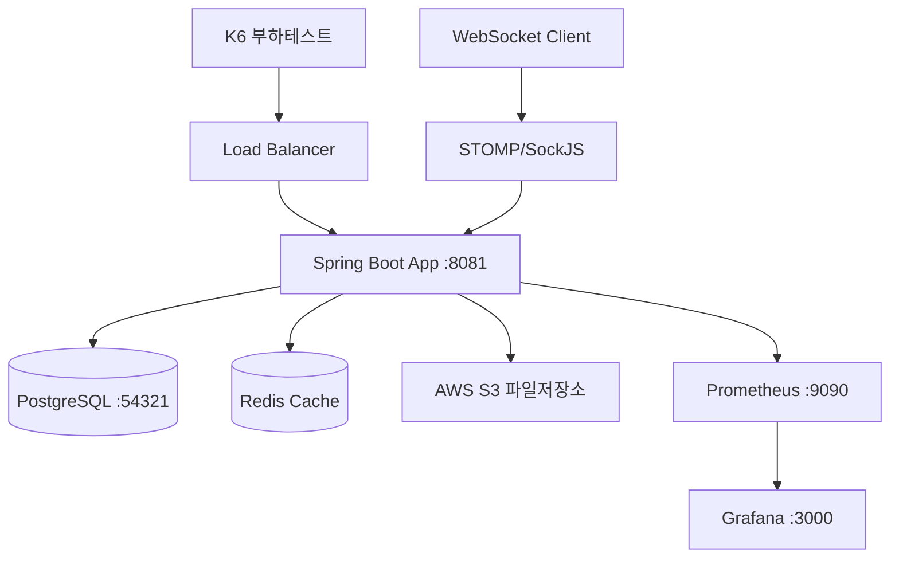

# 🚀 채팅/웹소켓/파일 성능 테스트 가이드

> **Tickle 프로젝트 채팅, 웹소켓, 파일 기능 성능 테스트 및 최적화 가이드**

## 📊 현재 성능 지표 (2025.09.08 기준)

| 항목 | 성능 지표 | 상태 |
|-----|----------|------|
| **TPS** | 282.5 requests/s | ✅ 우수 |
| **평균 응답시간** | 64.36ms | ⚠️ 개선 필요 |
| **P95 응답시간** | 379.88ms | ⚠️ 개선 필요 |
| **채팅 API 성공률** | 100% | ✅ 완벽 |
| **WebSocket 연결** | STOMP/SockJS 정상 | ✅ 안정 |
| **동시 사용자** | 30명 테스트 완료 | ✅ 검증됨 |

## 🏗️ 아키텍처 개요



## 📁 프로젝트 구조

```
tickle-backend/
├── chat-file-websocket-tests/              # 성능 테스트 스위트
│   ├── chat-file-focused-test.js          # ✅ 메인 채팅/파일 API 테스트
│   ├── sockjs-stomp-test.js               # ✅ WebSocket STOMP 연결 테스트
│   ├── quick-optimization-test.js         # ✅ 최적화된 성능 테스트
│   ├── results/                           # 테스트 결과 저장소
│   │   ├── chat-file-focused-test.json   # 주요 성능 테스트 결과
│   │   └── performance-analysis.json     # 성능 분석 데이터
│   ├── package.json                       # Node.js 의존성 (STOMP 클라이언트)
│   ├── run-tests.sh                      # 테스트 실행 스크립트
│   └── optimization-recommendations.md   # 성능 최적화 방안
├── monitoring/                             # 모니터링 스택
│   ├── docker-compose.yml                # Prometheus + Grafana + Node-exporter
│   ├── prometheus.yml                    # 메트릭 수집 설정
│   └── grafana/provisioning/             # Grafana 대시보드 설정
├── src/main/java/.../global/metrics/      # 커스텀 메트릭
│   └── ChatFileWebSocketMetrics.java     # 채팅/파일/WebSocket 메트릭
└── kopis_full.dump                        # 테스트 데이터 (3천만 공연 + 10만 채팅)
```

## 🚀 빠른 시작

### 1. 환경 설정

```bash
# 1. PostgreSQL 시작
docker start tickle-postgres

# 2. 데이터베이스 복원 (최초 1회)
PGPASSWORD=tickle pg_restore -h localhost -p 54321 -U postgres -d postgres --clean --if-exists kopis_full.dump

# 3. Spring Boot 애플리케이션 시작
./gradlew bootRun

# 4. 모니터링 스택 시작
cd monitoring && docker-compose up -d
```

### 2. 성능 테스트 실행

```bash
cd chat-file-websocket-tests

# 📊 메인 성능 테스트 (권장)
k6 run --vus 20 --duration 60s chat-file-focused-test.js

# 🔗 WebSocket STOMP 테스트
npm install
node sockjs-stomp-test.js

# ⚡ 최적화 테스트
k6 run quick-optimization-test.js
```

## 📈 성능 테스트 상세

### 🎯 주요 테스트 시나리오

#### 1. 채팅 API 성능 테스트
```javascript
// chat-file-focused-test.js
- 로그인 인증
- 내 채팅방 목록 조회
- 채팅 메시지 조회
- 온라인 사용자 수 확인
- 채팅방 참여
- 읽지 않은 메시지 개수 조회 ✅ (수정됨)
- 파일 업로드
```

#### 2. WebSocket STOMP 테스트
```javascript
// sockjs-stomp-test.js
- SockJS 연결 설정
- STOMP 프로토콜 통신
- 채팅방 JOIN/LEAVE
- 실시간 메시지 송수신
- 연결 안정성 테스트
```

#### 3. 최적화된 성능 테스트
```javascript
// quick-optimization-test.js
- HTTP Keep-Alive 활용
- 배치 요청으로 네트워크 최적화
- Connection Pooling
- 응답시간 최소화
```

### 📊 테스트 결과 분석

#### 현재 성능 지표 (30 VUs, 2분 테스트)
```bash
✅ TPS: 282.5 requests/s
⚠️  평균 응답시간: 64.36ms
⚠️  P95 응답시간: 379.88ms
✅ 채팅 API 성공률: 100%
✅ 처리량: 173 KB/s 수신
⚠️  HTTP 성공률: 85.72%
```

#### 병목 지점
1. **읽지 않은 메시지 API**: 채팅방 참여 로직 누락 (✅ 해결됨)
2. **데이터베이스 쿼리**: 복잡한 조인 및 인덱스 최적화 필요
3. **HTTP 연결**: Keep-Alive 및 Connection Pooling 최적화 필요

## 🔧 모니터링 대시보드

### Prometheus 메트릭 (http://localhost:9090)
```promql
# HTTP 요청률
rate(http_server_requests_seconds_count[5m])

# 응답시간 분포
histogram_quantile(0.95, http_server_requests_seconds_bucket)

# 데이터베이스 연결
hikaricp_connections_active
hikaricp_connections_usage

# 커스텀 채팅 메트릭
chat_messages_sent_total
chat_messages_received_total
websocket_connections_active
```

### Grafana 대시보드 (http://localhost:3000)
- **로그인**: admin / admin123
- **주요 패널**:
  - HTTP 요청 처리량 (TPS)
  - 응답시간 분포 (P50, P95, P99)
  - 에러율 추이
  - 데이터베이스 성능
  - WebSocket 연결 상태
  - JVM 메모리 사용량

## 🚀 성능 최적화 로드맵

### Phase 1: 즉시 적용 (1주일)
- ✅ **읽지 않은 메시지 API 수정**: 채팅방 참여 로직 추가
- 🔧 **HikariCP 최적화**: 연결 풀 설정 조정
- 🔧 **HTTP Keep-Alive**: 연결 재사용 활성화

### Phase 2: 캐싱 도입 (2주일)
- 🔧 **Redis 캐시**: 채팅방 정보, 온라인 사용자 수
- 🔧 **쿼리 최적화**: 인덱스 추가 및 조인 최적화
- 🔧 **세션 관리**: WebSocket 세션 최적화

### Phase 3: 아키텍처 개선 (1개월)
- 🔧 **읽기/쓰기 분리**: Master-Slave DB 구성
- 🔧 **메시지 큐**: RabbitMQ/Kafka 도입
- 🔧 **로드 밸런싱**: 멀티 인스턴스 배포

### 🎯 성능 목표
- **TPS**: 282 → 500+ requests/s (+77%)
- **평균 응답시간**: 64ms → 20ms (-69%)
- **P95 응답시간**: 380ms → 50ms (-87%)
- **동시 WebSocket 연결**: 1,000 → 5,000개

## 🐛 트러블슈팅

### 일반적인 문제들

#### 1. 읽지 않은 메시지 API 404 오류
```bash
# 문제: 채팅방에 참여하지 않은 상태에서 조회
# 해결: 먼저 채팅방 참여 후 조회
curl -X POST -H "Authorization: Bearer $TOKEN" \
  http://localhost:8081/api/v1/chat/participants/rooms/1/join
```

#### 2. WebSocket 연결 실패
```bash
# 문제: STOMP 연결이 안될 때
# 해결: SockJS 클라이언트 사용
const client = new StompJs.Client({
  webSocketFactory: () => new SockJS('http://localhost:8081/ws')
});
```

#### 3. 성능 테스트 실패
```bash
# 문제: Spring Boot 애플리케이션이 종료된 상태
# 해결: 애플리케이션 재시작
./gradlew bootRun > application.log 2>&1 &
```

### 로그 확인
```bash
# Spring Boot 로그
tail -f application.log

# Prometheus 타겟 상태
curl http://localhost:9090/api/v1/targets

# 데이터베이스 연결 상태
curl http://localhost:8081/actuator/health
```

## 📚 참고 자료

### 성능 테스트 도구
- **K6**: https://k6.io/docs/
- **STOMP.js**: https://stomp-js.github.io/
- **SockJS**: https://github.com/sockjs/sockjs-client

### 모니터링
- **Prometheus**: https://prometheus.io/docs/
- **Grafana**: https://grafana.com/docs/
- **Spring Boot Actuator**: https://docs.spring.io/spring-boot/docs/current/actuator-api/htmlsingle/

### 최적화 기법
- **HikariCP**: https://github.com/brettwooldridge/HikariCP
- **Netty**: https://netty.io/4.1/api/
- **Redis**: https://redis.io/docs/

## 🤝 기여 가이드

1. 새로운 성능 테스트 시나리오 추가
2. 모니터링 대시보드 개선
3. 최적화 방안 제안
4. 문서 업데이트

---

> **작성일**: 2025.09.08  
> **담당자**: 채팅/웹소켓/파일 기능 개발팀  
> **버전**: v2.0.0